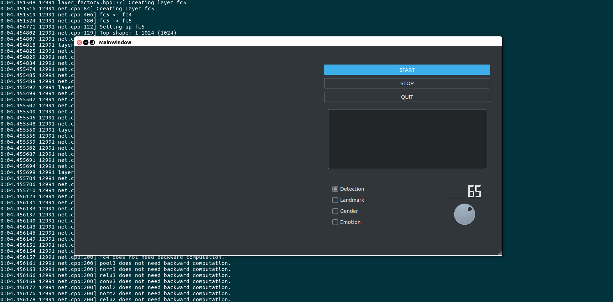
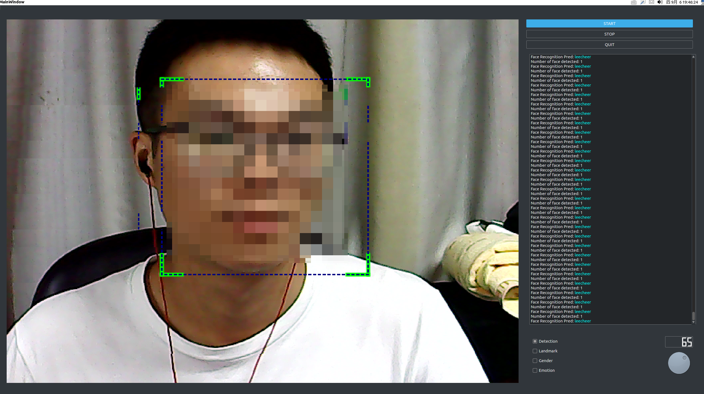
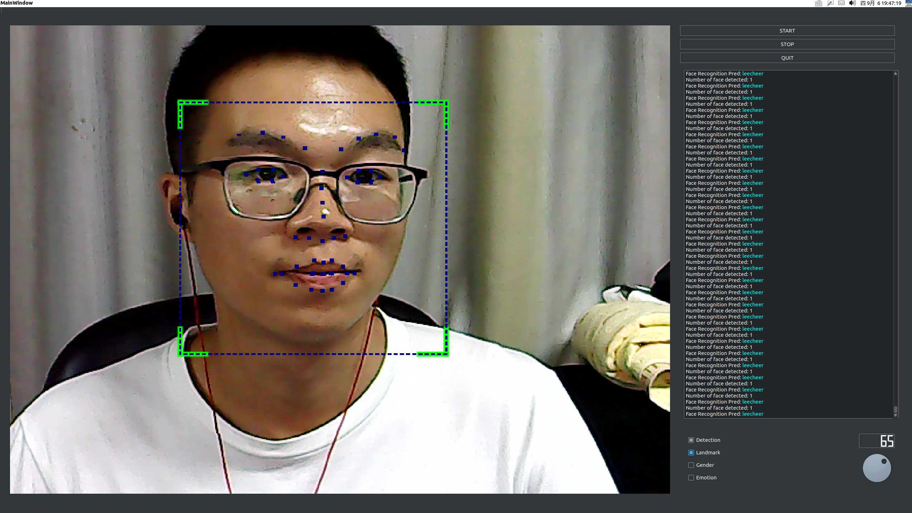
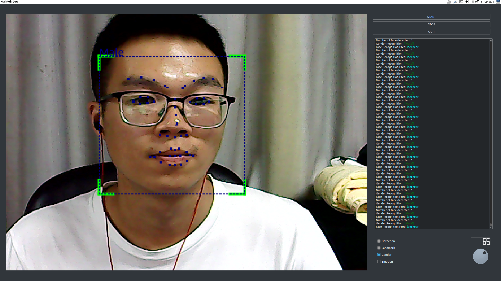
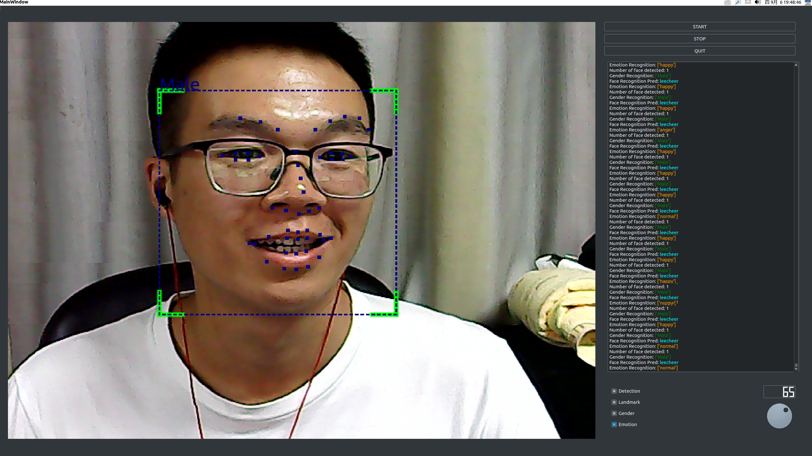
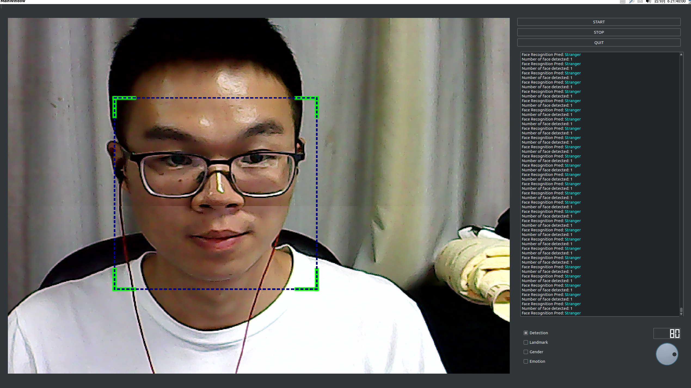

Deep learning, after train model, we deploy caffe model.
==
cd project_full_code // enter the folder 
python main.py //To run the code.
----
The software begin.
--
Click the button "START",Start the face recognition.
--
Click the button "Landmark",open or end the function of Landmark recognition.
--
Click the button "Gender",open or end the function of Gender recognition.
--
Click the button "Emotion",open or end the function of Emotion recognition. 
--
Turn up or down the threshold, change the factor of safty.Increase the value of threshold,it's harder for us to pass the face verification
--
