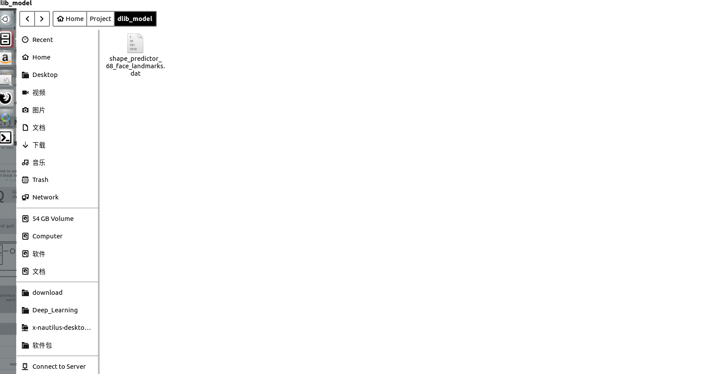

==
The dlib model we use is dlib official model shape_predictor_68_face_landmarks.dat 
We could download it on the Internet for free. 
Like ... 

My email: tolq@foxmail.com 
contact me if you have any questions.
